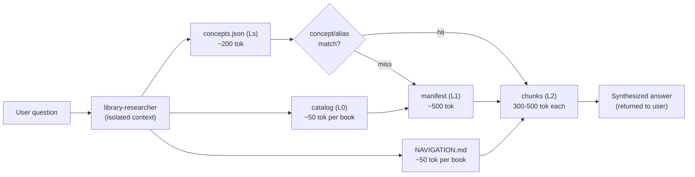

<p align="center">
  
</p>

# AgentLib

**AI agents waste massive tokens navigating knowledge because they have no map.**

When an agent needs to answer a question from a book, a paper corpus, or a database, it has no idea where to look. So it guesses. It reads the wrong file, backs up, reads another, accumulates context — and every token it has already read gets re-processed on every subsequent call. The cost isn't linear. It's **O(n^2)** in the number of tool calls: the marginal cost of call *n+1* equals the entire accumulated context at that point.

AgentLib gives agents a map.

## How it works

AgentLib has three parts:

1. **Ingestion pipelines** — preprocess books, scientific paper corpora, and databases into small, self-contained chunks with lightweight metadata at multiple layers.
2. **Universal navigation skill** (`agentlib-knowledge`) — teaches the agent to read cheap metadata first, then drill into specific chunks.
3. **Research agent** (`library-researcher`) — runs in an isolated context to keep the main conversation clean. All navigation and chunk reading happens in the agent's context; only a synthesized answer returns.

No MCP server required. No tool calls. The agent reads preprocessed files directly from `~/.claude/plugins/agentlib/library/`.

### How agents navigate the library



**Ls hit (fast path):** NAVIGATION → concepts.json → chunks — **2-3 reads, ~1k tokens**

**Ls miss (slow path):** NAVIGATION → catalog → manifest → chunks — **5-6 reads, ~5k tokens**

The concept index includes **aliases** (abbreviations, acronyms, synonyms) generated by the LLM at ingestion time. Searching "CDX" matches the alias on "CycloneDX"; searching "SBOM" matches "Software Bill of Materials". This turns misses into hits without any runtime cost.

### Three metadata layers

```
L0  "What exists?"       →  catalog/NAVIGATION.md: ~50 tokens per book   (cheap)
L1  "What's inside?"     →  manifest: structure, summaries, concepts      (moderate)
L2  "Give me the content" →  small self-contained chunks, 300-500 tok     (expensive)
```

Plus a **concept index** shortcut (Ls) that jumps directly to relevant chunks when the agent already knows what it's looking for. Each concept carries LLM-generated aliases so the agent can find it by abbreviation, acronym, or alternative phrasing.

### Library structure

```
library/
├── NAVIGATION.md                          ← Start here — index of everything
├── books/
│   ├── catalog.json                       ← L0
│   └── {book-id}/
│       ├── manifest.compact.json          ← L1
│       ├── concepts.json                  ← Ls
│       └── chunks/
│           └── {chunk-id}.md              ← L2
└── corpus/
    └── {corpus-id}/
        ├── corpus_catalog.json            ← L0 (topic clusters)
        ├── concept_index.json             ← Ls (cross-paper concepts)
        ├── clusters/{cluster-id}.json     ← L0b (papers per cluster)
        └── papers/{paper-id}/
            ├── manifest.compact.json      ← L1
            └── chunks/{chunk-id}.md       ← L2
```

## Benchmarks

### Agent delegation — context-efficient research

The `library-researcher` agent runs navigation in an isolated context window. Only the synthesized answer returns to the main conversation, keeping it clean for follow-up questions.

**Query: "What is the dimensionless constant η in Davidson's Planck area formula?"**

| Metric | AgentLib (agent) | AgentLib (direct) | Raw PDFs |
|--------|-----------------|-------------------|----------|
| Main context | **19k (9%)** | 30k (15%) | 19k (9%) |
| Hidden agent tokens | 13.6k | — | 60.2k |
| **Total tokens** | **~33k** | ~30k | **~79k** |
| Time | **32s** | 38s | 1m 9s |
| Correct answer | Yes | Yes | Yes |

The agent approach uses **58% fewer total tokens** than raw PDF reading, and keeps the main context at just **3.1k messages** — meaning you can ask many research questions in a single session without filling up the context window.

**Multi-query session (2 questions in one session):**

| Query | Agent tokens | Main context added |
|-------|-------------|-------------------|
| Davidson η constant (corpus) | 13.6k | ~3.1k |
| Prompt injection defenses (book) | 20.5k | ~4.1k |
| **Total** | **34.1k** | **7.2k** |

Without the agent, two direct queries would consume ~30k+ in messages. With it, only 7.2k.

### Book queries — 47-82% token reduction

**Question:** "What specific actor frameworks does the book mention for multiagent communication?"

| Metric | AgentLib | Raw PDF | Reduction |
|--------|----------|---------|-----------|
| Content tokens | 6.9k | 38.6k | **82%** |
| Answer quality | Correct — Ray, Orleans, Akka | Correct — Ray, Orleans, Akka | Same |
| Source citations | Yes (chapter + chunk IDs) | No | — |

**Question:** "What are the maturity levels for SBOM according to the CycloneDX standard?"

| Metric | AgentLib | Raw PDF | Reduction |
|--------|----------|---------|-----------|
| Content tokens | 7.8k | 14.7k | **47%** |
| Answer quality | Correct (5 dimensions table) | Correct (5 dimensions table) | Same |

### Corpus queries — 57% token reduction

**Question:** "How does Davidson connect quantum mechanics to general relativity?"

| Metric | AgentLib | Raw PDFs | Reduction |
|--------|----------|----------|-----------|
| Total tokens | 36k | ~83k | **57%** |
| Time | 43s | 1m 56s | **2.7x faster** |
| Answer quality | 3 approaches with citations | 4 approaches | Same |

### Cost simulations

Simulated on realistic workloads (15-book library, 487-paper corpus, 80-table database):

|                      | Books |       | Papers |       | Database |       |
|----------------------|-------|-------|--------|-------|----------|-------|
| **Metric**           | Base  | AL    | Base   | AL    | Base     | AL    |
| Tool calls           | 5     | 2     | 6      | 5     | 7        | 4     |
| Cumul. input tokens  | 25.9K | 4.5K  | 51.7K  | 23.4K | 23.3K    | 10.4K |
| Wrong reads/queries  | 1     | 0     | 1      | 0     | 2        | 0     |
| **Token reduction**  |       | **82%** |      | **55%** |        | **55%** |

The core principle: *no heavy indexing, no vector databases — just smart, lightweight metadata and small content blobs.*

## Install

```bash
# From GitHub
git clone https://github.com/barkain/agentlib.git
claude --plugin-dir ./agentlib

# Or add as a marketplace plugin
/plugin marketplace add barkain/agentlib
/plugin install agentlib
```

## Usage

### Ingest a book
```bash
/agentlib:agentlib-ingest-book ~/books/owasp-guide.pdf
```

### Ingest a paper corpus
```bash
/agentlib:agentlib-ingest-corpus ~/papers/my-research-papers/
```

### Configure API key
```bash
/agentlib:agentlib-configure set-key <your-api-key>
```

### Browse the library
```bash
/agentlib:agentlib-library
```

### Querying

**Auto-trigger** — just ask naturally. The skill activates when it detects research/knowledge questions:
> "What specific actor frameworks does the book mention for multiagent communication?"

**Explicit invocation** — prefix with `/agentlib-knowledge` when you want the library's answer, not Claude's training data:
> /agentlib-knowledge What defensive techniques protect against prompt injection?

The skill delegates to the `library-researcher` agent, which navigates `NAVIGATION.md` → concept indexes → specific chunks in an isolated context. Only the synthesized answer with citations returns to your conversation.

## LLM Providers

AgentLib supports 5 LLM providers for ingestion and summarization (auto-detected from environment):

| Provider | Model | Env var |
|----------|-------|---------|
| Anthropic | Claude Haiku 4.5 | `ANTHROPIC_API_KEY` |
| OpenAI | GPT-4o Mini | `OPENAI_API_KEY` |
| xAI | Grok-3 Mini | `XAI_API_KEY` |
| Google | Gemini 2.0 Flash | `GOOGLE_API_KEY` |
| DeepSeek | DeepSeek Chat | `DEEPSEEK_API_KEY` |

Set `AGENTLIB_PROVIDER` to override auto-detection.

## Examples

- [Book walkthrough](examples/sbom-walkthrough.md) — ingesting the OWASP CycloneDX SBOM guide and querying it
- [Corpus walkthrough](examples/corpus-walkthrough.md) — ingesting 8 physics papers by Prof. Aharon Davidson and querying specific formulas

## Development

```bash
uv sync --dev        # Install dependencies
uv run pytest        # Run tests
```

## License

MIT
