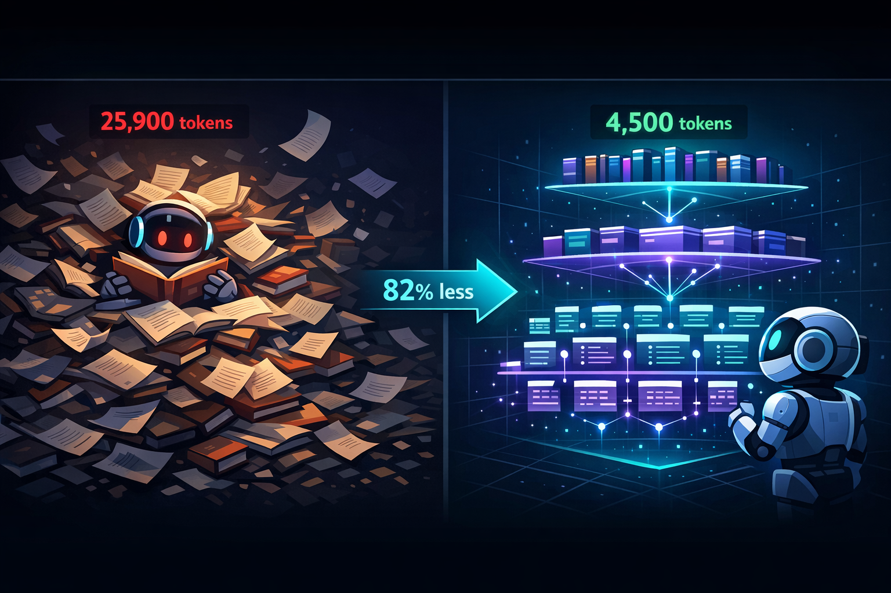

<p align="center">
  
</p>

# AgentLib

**AI agents waste massive tokens navigating knowledge because they have no map.**

When an agent needs to answer a question from a book, a paper corpus, or a database, it has no idea where to look. So it guesses. It reads the wrong file, backs up, reads another, accumulates context — and every token it has already read gets re-processed on every subsequent call. The cost isn't linear. It's **O(n²)** in the number of tool calls: the marginal cost of call *n+1* equals the entire accumulated context at that point.

AgentLib gives agents a map.

## How it works

Instead of reading raw content and hoping for the best, the agent navigates through three lightweight metadata layers:

```
L0  "What exists?"       →  catalog: ~50 tokens per book          (cheap)
L1  "What's inside?"     →  manifest: structure, summaries, concepts   (moderate)
L2  "Give me the content" →  small self-contained chunks, 300-500 tok  (expensive)
```

Plus a **concept search** shortcut (Ls) that jumps directly to relevant chunks when the agent already knows what it's looking for.

## Real-World Example

**Question:** "What are the maturity levels for SBOM according to the CycloneDX standard?"
**Source:** *Authoritative Guide to SBOM* (CycloneDX standard, 20 chapters, 98 chunks)

### AgentLib vs raw PDF

| Metric | AgentLib | Raw PDF | Reduction |
|--------|----------|---------|-----------|
| Content tokens (messages) | 7.8k | 14.7k | **47%** |
| Total context | 24k | 30k | **20%** |
| Answer quality | Correct (5 dimensions table) | Correct (5 dimensions table) | Same |

### How AgentLib navigated (3 calls)

1. `search_concepts("SBOM maturity levels")` — found "SCVS BOM Maturity Model"
2. `open_book("authoritativeguide-to-sbom")` — compact manifest (~1.8k tokens)
3. `read_chunks(["ch10-s03-001", "ch10-s04-001"])` — exact content (~700 tokens)

### How raw PDF was read

Claude Code read the entire 80-page PDF and scanned for the answer — 14.7k content tokens, no structure, no way to skip irrelevant pages.

> **Note:** In this test, concept search was not fully functional, so the agent fell back to the `open_book` -> `read_chunks` path (3 calls). With working concept search, the optimal path is `search_concepts` -> `read_chunks` (2 calls, ~3-4k content tokens, ~75% reduction).

## Cost simulations

Simulated on realistic workloads (15-book library, 487-paper corpus, 80-table database):

|                      | Books |       | Papers |       | Database |       |
|----------------------|-------|-------|--------|-------|----------|-------|
| **Metric**           | Base  | AL    | Base   | AL    | Base     | AL    |
| Tool calls           | 5     | 2     | 6      | 5     | 7        | 4     |
| Cumul. input tokens  | 25.9K | 4.5K  | 51.7K  | 23.4K | 23.3K    | 10.4K |
| Wrong reads/queries  | 1     | 0     | 1      | 0     | 2        | 0     |
| **Token reduction**  |       | **82%** |      | **55%** |        | **55%** |

Each domain has a different primary win. **Books:** token efficiency (fewer calls, smaller reads). **Papers:** selection accuracy (find the right papers first). **Databases:** query correctness (right SQL on first attempt).

The core principle: *no heavy indexing, no vector databases — just smart, lightweight metadata and small content blobs.*

## Installation

```bash
# As a Claude Code plugin
/plugin marketplace add barkain/agentlib
/plugin install agentlib
```

## Usage

### Ingest a book
```bash
/agentlib-ingest-book ~/books/owasp-guide.pdf
```

### Query naturally
The agent discovers and uses AgentLib tools automatically:
```
"What does OWASP say about token rotation?"
"What are the most effective approaches for reducing hallucination in LLMs?"
"Total revenue by customer region last quarter, excluding cancelled orders?"
```

### MCP Tools

| Tool | Layer | What it does |
|------|-------|-------------|
| `browse_library` | L0 | List all books with metadata |
| `open_book` | L1 | Get chapter structure, summaries, key concepts |
| `read_chunks` | L2 | Read specific content chunks (max 10/call) |
| `search_concepts` | Ls | Find concepts across the library |

## LLM Providers

AgentLib supports 5 LLM providers for ingestion and summarization (auto-detected from environment):

| Provider | Model | Env var |
|----------|-------|---------|
| Anthropic | Claude Haiku 4.5 | `ANTHROPIC_API_KEY` |
| OpenAI | GPT-4o Mini | `OPENAI_API_KEY` |
| xAI | Grok-3 Mini | `XAI_API_KEY` |
| Google | Gemini 2.0 Flash | `GOOGLE_API_KEY` |
| DeepSeek | DeepSeek Chat | `DEEPSEEK_API_KEY` |

Set `AGENTLIB_PROVIDER` to override auto-detection.

## Development

```bash
uv sync --dev        # Install dependencies
uv run pytest        # Run tests
uv run python server.py  # Start MCP server directly
```

## License

MIT
