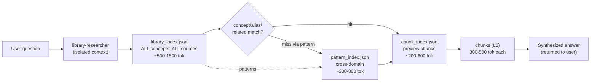
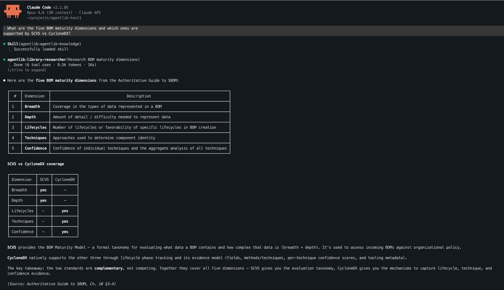
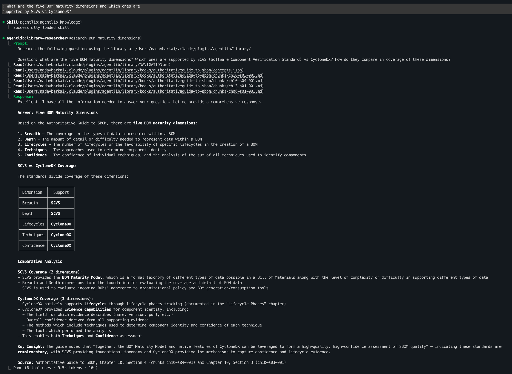

<p align="center">
  
</p>

# AgentLib

**Curate your knowledge library. Your agent works from sources you trust.**

AI agents search the internet or re-read documents from scratch on every question. They have no persistent knowledge, no domain expertise, and no way to distinguish trusted sources from noise.

AgentLib changes this. Ingest the books, papers, and documents that matter for your work — once. Your agent gets a structured, indexed library it can navigate autonomously: finding relevant content in seconds, citing exact sources, and proactively consulting your library while coding.

- **Your sources, your curation** — choose which books, papers, standards, and internal docs your agent should know
- **Always available** — ingested once, accessible across every session with no re-uploading
- **Proactive, not reactive** — the agent checks the library automatically when working on domain-specific tasks
- **Citable answers** — every response traces back to a specific book, chapter, and section

## How it works

AgentLib has three parts:

1. **Ingestion pipelines** — preprocess books, scientific paper corpora, and databases into small, self-contained chunks with lightweight metadata at multiple layers.
2. **Universal navigation skill** (`agentlib-knowledge`) — teaches the agent to read cheap metadata first, then drill into specific chunks.
3. **Research agent** (`library-researcher`) — runs in an isolated context to keep the main conversation clean. All navigation and chunk reading happens in the agent's context; only a synthesized answer returns.

No MCP server required. No tool calls. The agent reads preprocessed files directly from `~/.claude/plugins/agentlib/library/`.

### How agents navigate the library



**Fast path (concept hit):** library_index → chunk_index (preview) → read 2-3 chunks — **3 reads, ~1.5k tokens**

**Pattern path (cross-domain):** library_index → pattern_index → chunk_index → chunks — **4 reads, ~2.5k tokens**

**Recovery on miss:** related concepts → pattern traversal → per-book concepts.json → Grep fallback

#### Unified library index

`library_index.json` is the single entry point for the entire library. One file, one read, all books and corpora. Each concept carries:

- **aliases** — abbreviations, acronyms, synonyms (searching "CDX" matches "CycloneDX")
- **related** — directly connected concepts in the same domain ("OAuth 2.0" → "JWT", "access tokens")
- **patterns** — abstract structural fingerprints for cross-domain discovery (see below)
- **sources** — which books/papers contain the concept and their chunk IDs

#### Pattern fingerprints — associative recall

Every concept is tagged with 2-3 **pattern fingerprints**: abstract, domain-independent descriptors of its structural nature. These enable a "this reminds me of..." capability that keyword search can never provide.

For example, "OAuth token rotation", "TLS certificate renewal", and "SSH key rotation" all share the pattern `credential-cycling`. An agent reading about token rotation can discover structurally analogous solutions in completely different books — without any keyword overlap.

`pattern_index.json` is the reverse lookup: pattern → all concepts sharing that shape across the library. A seed vocabulary of ~40 common patterns ensures consistency across books; fuzzy matching merges near-duplicates.

#### Chunk preview index

`chunk_index.json` lets agents see what's inside each chunk *before* reading it: section title, concepts covered, token count, and prev/next chains. This eliminates blind reads — the agent picks the 2-3 best chunks from a set of candidates instead of reading 5 and hoping.

<p align="center">
  
</p>

*The agent automatically consults the knowledge library when it detects a domain-specific question — no explicit command needed.*

<details>
<summary>Expanded: how the library-researcher navigates</summary>
<p align="center">
  
</p>
</details>

### Metadata layers

```
Lx  "What do I know?"    →  library_index.json: ALL concepts, ALL sources  (cheapest)
Lp  "What's this like?"  →  pattern_index.json: cross-domain patterns      (cheap)
Lc  "What's in a chunk?" →  chunk_index.json: preview before reading       (cheap)
L0  "What exists?"       →  catalog/NAVIGATION.md: ~50 tokens per book     (cheap)
Ls  "Jump to concept"    →  concepts.json: per-book concept→chunk map      (cheap)
L1  "What's inside?"     →  manifest: structure, summaries, concepts        (moderate)
L2  "Give me the content" →  small self-contained chunks, 300-500 tok      (expensive)
```

Chunks are **content-aware**: tables and code fences are kept atomic (soft cap 500, hard cap 1 000 tokens). PDF tables are extracted via PyMuPDF and rendered as markdown pipe tables. Figures are extracted from PDFs with vision-based summarization, appearing as placeholders in chunks.

The concept index includes LLM-generated **aliases**, **related concepts**, and **pattern fingerprints** — turning keyword misses into graph traversals and enabling cross-domain discovery.

### Library structure

```
library/
├── NAVIGATION.md                          ← Human-readable index
├── library_index.json                     ← Lx: unified concept index (ALL sources)
├── pattern_index.json                     ← Lp: cross-domain pattern→concept map
├── books/
│   ├── catalog.json                       ← L0
│   └── {book-id}/
│       ├── manifest.compact.json          ← L1 (sections with chunk IDs)
│       ├── concepts.json                  ← Ls (with aliases, patterns, related)
│       ├── chunk_index.json               ← Lc: chunk preview metadata
│       └── chunks/
│           └── {chunk-id}.md              ← L2
└── corpus/
    └── {corpus-id}/
        ├── corpus_catalog.json            ← L0 (topic clusters)
        ├── concept_index.json             ← Ls (cross-paper, with patterns)
        ├── clusters/{cluster-id}.json     ← L0b (papers per cluster)
        └── papers/{paper-id}/
            ├── manifest.compact.json      ← L1
            └── chunks/{chunk-id}.md       ← L2
```

## Benchmarks

### Agent delegation — context-efficient research

The `library-researcher` agent runs navigation in an isolated context window. Only the synthesized answer returns to the main conversation, keeping it clean for follow-up questions.

**Query: "What is the dimensionless constant η in Davidson's Planck area formula?"**

| Metric | AgentLib (agent) | AgentLib (direct) | Raw PDFs |
|--------|-----------------|-------------------|----------|
| Main context | **19k (9%)** | 30k (15%) | 19k (9%) |
| Hidden agent tokens | 13.6k | — | 60.2k |
| **Total tokens** | **~33k** | ~30k | **~79k** |
| Time | **32s** | 38s | 1m 9s |
| Correct answer | Yes | Yes | Yes |

The agent approach uses **58% fewer total tokens** than raw PDF reading, and keeps the main context at just **3.1k messages** — meaning you can ask many research questions in a single session without filling up the context window.

**Multi-query session (2 questions in one session):**

| Query | Agent tokens | Main context added |
|-------|-------------|-------------------|
| Davidson η constant (corpus) | 13.6k | ~3.1k |
| Prompt injection defenses (book) | 20.5k | ~4.1k |
| **Total** | **34.1k** | **7.2k** |

Without the agent, two direct queries would consume ~30k+ in messages. With it, only 7.2k.

### Book queries — 47-82% token reduction

**Question:** "What specific actor frameworks does the book mention for multiagent communication?"

| Metric | AgentLib | Raw PDF | Reduction |
|--------|----------|---------|-----------|
| Content tokens | 6.9k | 38.6k | **82%** |
| Answer quality | Correct — Ray, Orleans, Akka | Correct — Ray, Orleans, Akka | Same |
| Source citations | Yes (chapter + chunk IDs) | No | — |

**Question:** "What are the maturity levels for SBOM according to the CycloneDX standard?"

| Metric | AgentLib | Raw PDF | Reduction |
|--------|----------|---------|-----------|
| Content tokens | 7.8k | 14.7k | **47%** |
| Answer quality | Correct (5 dimensions table) | Correct (5 dimensions table) | Same |

### Corpus queries — 57% token reduction

**Question:** "How does Davidson connect quantum mechanics to general relativity?"

| Metric | AgentLib | Raw PDFs | Reduction |
|--------|----------|----------|-----------|
| Total tokens | 36k | ~83k | **57%** |
| Time | 43s | 1m 56s | **2.7x faster** |
| Answer quality | 3 approaches with citations | 4 approaches | Same |

### Cost simulations

Simulated on realistic workloads (15-book library, 487-paper corpus, 80-table database):

|                      | Books |       | Papers |       | Database |       |
|----------------------|-------|-------|--------|-------|----------|-------|
| **Metric**           | Base  | AL    | Base   | AL    | Base     | AL    |
| Tool calls           | 5     | 2     | 6      | 5     | 7        | 4     |
| Cumul. input tokens  | 25.9K | 4.5K  | 51.7K  | 23.4K | 23.3K    | 10.4K |
| Wrong reads/queries  | 1     | 0     | 1      | 0     | 2        | 0     |
| **Token reduction**  |       | **82%** |      | **55%** |        | **55%** |

The core principle: *no vector databases — just smart, interconnected metadata structures. Concepts link to related concepts, abstract patterns connect ideas across domains, and chunk previews eliminate blind reads.*

## Install

```bash
# From GitHub
git clone https://github.com/barkain/agentlib.git
claude --plugin-dir ./agentlib

# Or add as a marketplace plugin
/plugin marketplace add barkain/agentlib
/plugin install agentlib
```

## Usage

### Ingest a book
```bash
/agentlib:agentlib-ingest-book ~/books/owasp-guide.pdf
```

Ingestion runs chapter summarization in parallel and batches concept extraction in groups of 50 for large books. If ingestion fails partway through, re-run the same command — completed stages are skipped automatically. Stage 5 (concept extraction) retries up to 3 times on API failures.

### Ingest a paper corpus
```bash
/agentlib:agentlib-ingest-corpus ~/papers/my-research-papers/
```

### Configure API key
```bash
/agentlib:agentlib-configure set-key <your-api-key>
```

### Browse the library
```bash
/agentlib:agentlib-library
```

### Querying

**Auto-trigger** — just ask naturally. The skill activates when it detects research/knowledge questions:
> "What specific actor frameworks does the book mention for multiagent communication?"

**Explicit invocation** — prefix with `/agentlib-knowledge` when you want the library's answer, not Claude's training data:
> /agentlib-knowledge What defensive techniques protect against prompt injection?

The skill delegates to the `library-researcher` agent, which navigates `library_index.json` → `chunk_index.json` → specific chunks in an isolated context. Only the synthesized answer with citations returns to your conversation. When relevant, the agent also checks `pattern_index.json` for cross-domain analogies.

## LLM Providers

AgentLib supports 5 LLM providers for ingestion and summarization (auto-detected from environment):

| Provider | Model | Env var |
|----------|-------|---------|
| Anthropic | Claude Haiku 4.5 | `ANTHROPIC_API_KEY` |
| OpenAI | GPT-4o Mini | `OPENAI_API_KEY` |
| xAI | Grok-3 Mini | `XAI_API_KEY` |
| Google | Gemini 2.0 Flash | `GOOGLE_API_KEY` |
| DeepSeek | DeepSeek Chat | `DEEPSEEK_API_KEY` |

Set `AGENTLIB_PROVIDER` to override auto-detection. Set `AGENTLIB_CONCURRENCY` to control parallel ingestion workers (default 10).

## Examples

- [Book walkthrough](examples/sbom-walkthrough.md) — ingesting the OWASP CycloneDX SBOM guide and querying it
- [Corpus walkthrough](examples/corpus-walkthrough.md) — ingesting 8 physics papers by Prof. Aharon Davidson and querying specific formulas

## Development

```bash
uv sync --dev        # Install dependencies
uv run pytest        # Run tests
```

## License

MIT
